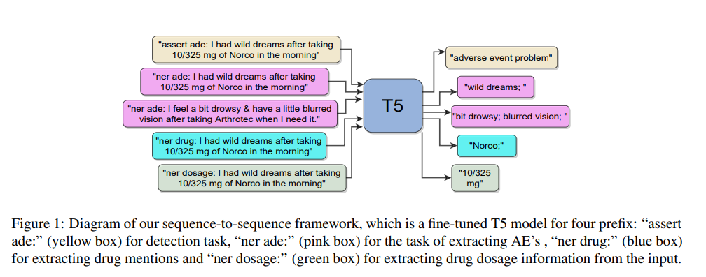

[](https://github.com/shivamraval98/MultiTask-T5_AE/blob/main/LICENSE) [](https://arxiv.org/pdf/2109.05815.pdf)

# MultiTask-T5_AE :book:
[Exploring a Unified Sequence-To-Sequence Transformer for Medical Product Safety Monitoring in Social Media](https://arxiv.org/pdf/2109.05815.pdf) accepted to be published in EMNLP 2021 Findings track explores the sequence-to-sequence transformers to detect and extract Adverse Events (AE) from various source for medical product safety monitoring.  
Adverse Events (AE) are harmful events resulting from the use of medical products. Although social media may be crucial for early AE detection, the sheer scale of this data makes it logistically intractable to analyze using human agents, with NLP representing the only low-cost and scalable alternative. In this paper, we frame AE Detection and Extraction as a sequence-to-sequence problem using the T5 model architecture and achieve strong performance improvements over competitive baselines on several English benchmarks (F1 = 0.71, 12.7% relative improvement for AE Detection; Strict F1 = 0.713, 12.4% relative improvement for AE Extraction).

Given an input sequence of words that potentially contains drug, dosage and AE mentions, we frame the AE detection (i.e. binary classification) and extraction (i.e. span detection) tasks as seq-to-seq problems, further finetuning T5 to generate Y, which is either the classification label or the text span with the AE. The example of prefixes used is shown in the figure below:



## Table of Contents
[Datasets](#datasets)

[Installation](#installation)

[Usage](#usage)

[How to Cite](#how-to-cite)

[References](#references)


## Datasets
The datasets used for experimentation is mentioned below:

#### 1. SMM4H
This dataset was introduced for the Shared Tasks on AE in the Workshop on Social Media Mining for Health Applications (SMM4H) (Weissenbacher et al., 2018). The dataset is composed of Twitter posts, typically short, informal texts with non-standard ortography, and it contains annotations for both detection (i.e., Task 1, classification) and extraction (i.e., Task 2, NER) of Adverse Events. The preparation of AE Detection dataset for SMM4H Task 1 requires SMM4H19_Task1.csv file in the /src/data/datasets/SMM4H_Task1/ folder. (column names: tweet_id, tweet, label). Similarly as Task 1 dataset, the importer function for Task 2 expects a file SMM4H19_Task2.csv in the /src/data/datasets/SMM4H_Task2/ folder. (column names: tweet_id,begin,end,type,extraction,drug,tweet,meddra_code,meddra_term <br />
SMM4H Task 2 Dataset Splits: [/src/data/splits/SMM4H_Task2](https://github.com/shivamraval98/MultiTask-T5_AE/tree/main/src/data/splits/SMM4H_Task2)

| Dataset                                                                                                                           | Total                                                 | Positive                                        | Negative                                              |
|-----------------------------------------------------------------------------------------------------------------------------------|-------------------------------------------------------|-------------------------------------------------|-------------------------------------------------------|
| SMM4H Task 1 (AE Detection)<br /> <br /> Train (80%) <br /> Validation (10%) <br /> Test (10%)                                    | 15,482 <br /> <br /> 12,386 <br /> 1,548 <br /> 1,548 | 1,339 <br /> <br /> 1,071 <br /> 134 <br /> 134 | 14,143 <br /> <br /> 11,315 <br /> 1,414 <br /> 1,414 |
| SMM4H Task 2 (AE Detection, AE Extraction and Drug Extraction)<br /> <br /> Train (60%) <br /> Validation (20%) <br /> Test (20%) | 2,276 <br /> <br /> 1,365 <br /> 455 <br /> 456       | 1300 <br /> <br /> 780 <br /> 260 <br /> 260    | 976 <br /> <br /> 585 <br /> 195 <br /> 196           |


#### 2. CADEC
CADEC contains 1,250 medical forum posts annotated with patient-reported AEs. In this dataset, texts are long and informal, often deviating from English syntax and punctuation rules. Forum posts may contain more than one AE. For our goals, we adopted the training, validation, and test splits proposed by Dai et al. (2020). The importer for CADEC expects a zip file CADEC.zip in the /src/data/datasets/CADEC/ folder and the dataset is available at: https://data.csiro.au/collections/collection/CIcsiro:10948/SQcadec/RP1/RS25/RORELEVANCE/STsearch-by-keyword/RI1/RT1/ (download the CADEC.v2.zip)  <br />
Dataset Splits: [/src/data/splits/CADEC](https://github.com/shivamraval98/MultiTask-T5_AE/tree/main/src/data/splits/CADEC)

| Dataset                                                                                                                           | Total                                         | Positive                                      | Negative                                 |
|-----------------------------------------------------------------------------------------------------------------------------------|-----------------------------------------------|-----------------------------------------------|------------------------------------------|
| SMM4H Task 1 (AE Detection, AE Extraction and Drug Extraction)<br /> <br /> Train (70%) <br /> Validation (15%) <br /> Test (15%) | 1,250 <br /> <br /> 875 <br /> 187 <br /> 188 | 1,105 <br /> <br /> 779 <br /> 163 <br /> 163 | 145 <br /> <br /> 96 <br /> 24 <br /> 25 |


#### 3. ADE Corpus v2 
This dataset (Gurulingappa et al., 2012) contains case reports extracted from MEDLINE and it was used for multi-task training, as it contains annotations for all tasks: drugs, dosage, AE detection and extraction. Splits are stratified, to maintain an equal ratio of positive and negative examples.This dataset is automatically prepared by the code by loading the dataset from the huggingface datasets package.

| Dataset                                                                                                    | Total                                                 | Positive                                            | Negative                                              |
|------------------------------------------------------------------------------------------------------------|-------------------------------------------------------|-----------------------------------------------------|-------------------------------------------------------|
| ADE Corpus v2 (AE Detection)<br /> <br /> Train (60%) <br /> Validation (20%) <br /> Test (20%)            | 23,516 <br /> <br /> 14,109 <br /> 4,703 <br /> 4,704 | 6,821 <br /> <br /> 4,091 <br /> 1,365 <br /> 1,365 | 16,695 <br /> <br /> 10,018 <br /> 3,338 <br /> 3,339 |
| ADE Corpus v2 (AE Extraction) <br /> <br /> Train (60%) <br /> Validation (20%) <br /> Test (20%)          | 6,821 <br /> <br /> 4,091 <br /> 1,365 <br /> 1,365   | 6,821 <br /> <br /> 4,091 <br /> 1,365 <br /> 1,365 | -                                                     |
| ADE Corpus v2 (Drug Extraction) <br /> <br/> Train (60%) <br /> Validation (20%) <br /> Test (20%)         | 7,100  <br /> <br /> 4,260 <br /> 1,420 <br /> 1,420  | 7,100 <br /> <br /> 4,260 <br /> 1,420 <br /> 1,420 | -                                                     |
| ADE Corpus v2 (Drug Dosage Extraction) <br /> <br /> Train (60%) <br /> Validation (20%) <br /> Test (20%) | 279 <br /> <br /> 167 <br /> 56 <br /> 56             | -                                                   | -                                                     |

#### 4. WEB-RADR 
This dataset is a manually curated benchmark based on tweets. It is used exclusively to test the performance of the multi-task models, as it was originally introduced only for testing purposes [(Dietrich et al., 2020)](https://link.springer.com/content/pdf/10.1007/s40264-020-00912-9.pdf). The importer for WEB-RADR expects the file WEB_RADR.csv in the folder /src/data/datasets/WEB_RADR/. (column names: tweet_id, tweet, label, extraction)

| Dataset                                                            | Total  | Positive | Negative |
|--------------------------------------------------------------------|--------|----------|----------|
| WEB-RADR (AE Detection and AE Extraction)<br /> <br /> Test (100%) | 57,481 | 1,056    | 56,425   |


#### 5. SMM4H-French
The SMM4H Twitter AE French dataset was introduced in the SMM4H20 (https://www.aclweb.org/anthology/2020.smm4h-1.4.pdf) and the importer expects the file SMM4H_French.csv in the folder /src/data/datasets/SMM4H_French/. (column_names: tweet_id, tweet, label). This dataset is only used for testing the zero-shot transfer learning.

| Dataset                                                            | Total  | Positive | Negative |
|--------------------------------------------------------------------|--------|----------|----------|
| SMM4H-French (AE Detection)<br /> <br /> Test (100%) | 1,941 | 31    | 1,910   |

After all the datastes being placed in their respective folders, the following command can be executed to load and prepare all the datasets for the model input.
```python
python src/prep_data,py
```


## Installation
#### 1. Setup Basic virtualenv 
```python
python3 -m venv t5_ade
source t5_ade/bin/activate
```

#### 2. Install Requirements
```bash
cd ae-detect
pip install -r requirements.txt
```

## Usage
#### 1. Running Baseline BERT Models:
```python
#Train Models
python train_baseline.py
#Evaluate Models
python eval_baseline.py
```
 More details of the parameters that can be changed are mentioned in the train_baseline.py.
 
 #### 2. Running T5 Models:
 ```python
 # Single Task T5 Model
 python t5_train.py
 
 #Multi-Task T5 Model
 python t5_multi_task_train.py

#T5 Evaluation
python t5_eval.py
 ```
There are couple of options for running the multi-task setting which are described in the script. The T5 model can be trained on Task Balancing (TB) or Task plus Dataset Balancing (TDB) approach for Proportional Mixing (PM) or Temperature Scaling (TS) strategies. For evaluation, the test set and the trained model path information can be changed in t5_eval.py script.


## How to Cite
```bibtex
@inproceedings{raval2021exploring,
  title={Exploring a Unified Sequence-To-Sequence Transformer for Medical Product Safety Monitoring in Social Media},
  author={Raval, Shivam and Sedghamiz, Hooman and Santus, Enrico and Alhanai, Tuka and Ghassemi, Mohammad and Chersoni, Emmanuele},
  booktitle={The 2021 Conference on Empirical Methods in Natural Language Processing},
  year={2021},
  organization={Association for Computational Linguistics (ACL)}
}
```

## References
[1] [Exploring the Limits of Transfer Learning with a Unified Text-to-Text Transformer](https://arxiv.org/pdf/1910.10683)

[2] [Towards Zero-Shot Conditional Summarization with Adaptive Multi-Task Fine-Tuning](https://www.ncbi.nlm.nih.gov/pmc/articles/PMC7757121/)

[3] [Improving Adverse Drug Event Extraction with SpanBERT on Different Text Typologies](https://arxiv.org/pdf/2105.08882.pdf)
